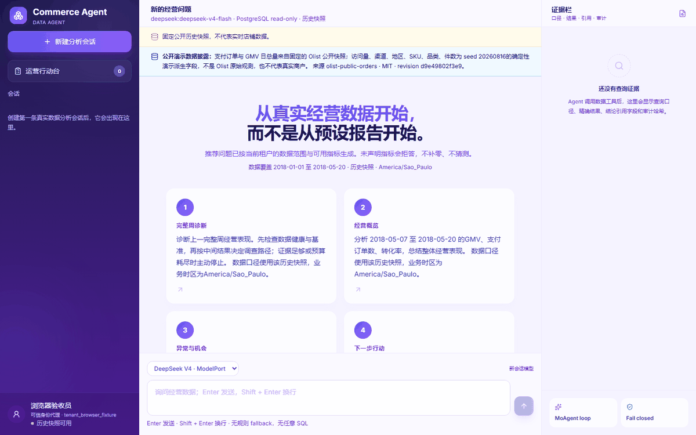
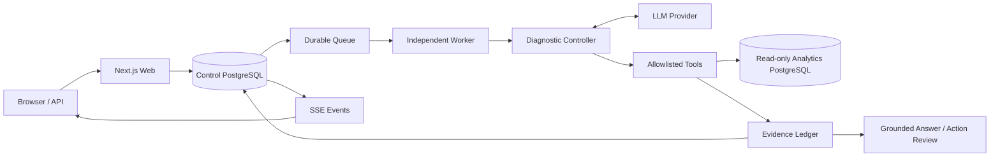

# Commerce Conversational Data Agent

一个证据优先的电商经营诊断 Agent：它会校验数据健康和时间口径，基于中间结果选择调查路径，并把结论中的每个数字绑定到可回查的工具结果。



> 演示使用固定的 Olist 公开历史快照与明确标记的衍生字段，不代表实时商户数据。浏览器演示、真实数据库测试和模型评测采用彼此独立的证据口径。

## 它解决什么问题

普通聊天式 BI 很容易给出一段看似合理、却无法复核的解释。本项目把经营诊断拆成受约束的执行流程：

1. 解析业务时区、完整自然周、指标、维度和筛选条件。
2. 检查每日分区、来源水位、能力覆盖与对账状态；不满足条件时拒绝继续分析。
3. 扫描 GMV、支付订单、访问量、转化率和客单价，并使用此前四个完整周中位数作为稳健基准。
4. 根据异常和局部信号动态选择渠道、区域、品类、SKU 或时间趋势调查。
5. 通过贡献恒等式、独立调查结果和矛盾检查决定是否提升为 driver。
6. 证据充分时生成一项待人工确认的行动；无可靠路径时主动停止。

## 核心能力

| 能力 | 工程实现 |
| --- | --- |
| 动态诊断 | 确定性 Controller 根据中间证据选择下一视图，并记录候选、排除原因、预算与停止原因 |
| 可核验 Evidence | claim 包含 Evidence ID、RFC 6901 JSON Pointer、metric、原值与 unit；服务端重新解引用并校验 |
| 正确的数据语义 | 比率按分子/分母重算；GMV、订单、流量、转化和 AOV 通过贡献分解与 residual 对账 |
| Fail closed | 缺指标、分区不完整、水位异常、跨租户、任意 SQL、未授权通知或引用失配都会阻断 |
| 行动闭环 | 建议默认为 proposed；负责人、期限和目标由人工确认，支持提醒、复盘、护栏和审计 |
| 可靠执行 | PostgreSQL durable queue、独立 Worker、lease/fencing、重试/死信、SSE 和幂等副作用 |
| 多租户隔离 | control/analytics 分库职责、最小权限数据库角色、RLS 与只读分析事务 |

## 架构



Web 只处理可信身份、输入校验、入队和读投影；Worker 执行 Agent。单次分析运行在 `REPEATABLE READ, READ ONLY` 快照中，模型不能生成任意 SQL，也不能绕过服务端解析好的查询范围。

详细设计见 [系统架构](docs/architecture.md) 和 [异步执行](docs/async-execution.md)。

## Evidence 如何核对

每张 Evidence 卡同时展示：

- 查询口径：当前期、比较期、基准策略、指标、维度、筛选、排序和 limit；
- 指标定义：聚合方式、可加性、派生公式、币种与业务时区；
- 实际结果：KPI 扫描、拆解、趋势或对比的原始结果表；
- 结论引用：`evidenceId + JSON Pointer + metric + value + unit`；
- 审计信息：请求/响应 SHA-256、查询时间、行数和来源水位。

如果路径不存在、数值或单位不一致、证据来自其他 run，或者叙述中出现未绑定数字，最终答案会被拒绝落库。

## 本地运行

要求 Node.js `22.19.x`、npm 10+、Docker 和 PostgreSQL 17。

```powershell
Copy-Item .env.example .env.local
docker compose -f compose.commerce.local.yml up -d --wait postgres
npm install
npm run db:migrate:commerce
npm run db:seed:commerce:public-demo
npm run dev
```

在 `.env.local` 中配置 DeepSeek、ModelPort 或本地 Qwen Provider，然后打开 <http://localhost:3000/commerce>。`npm run dev` 会同时启动 Web 和独立 Worker。

建议从“诊断上一完整周经营表现”开始，然后展开 finding 的 Evidence，核对结果行与字段路径，再查看行动卡的成功指标和护栏。

## 可复现验证

```text
npm run eval:commerce:local-controller  Oracle 隔离的生产 Controller 冻结评测
npm test                            单元、合同与离线评测
npm run test:coverage:critical      核心模块覆盖率门禁
npm run test:integration:commerce   PostgreSQL、RLS、队列和预算集成测试
npm run test:e2e:commerce:browser   desktop/mobile 浏览器流程
npm run test:e2e:commerce:live      Web → Worker → PostgreSQL → SSE → 模型链路
npm run release:check:commerce      不依赖外部凭据的完整发布门禁
```

最近一次本地冻结评测执行了 100 个基础案例和 250 个锁定改写：完整任务 100/100、数值与基准事实 100%、Evidence 覆盖与结构 100%、日期和安全改写 100%、安全红线 0。动态 Controller 的完整任务准确率比固定策略高 42 个百分点，平均分析调用从 1.34 降至 1.03。

本地结果不替代真实模型大样本、固定参考性能、飞书沙箱或外部用户研究。已验证项与尚未执行的外部门禁见 [验证状态](docs/validation-status.md)。

## 数据来源与边界

公开 Demo 基于 Olist 历史数据。订单与 GMV 来自固定上游文件；访问量、渠道、区域、SKU 和品类是带固定 seed、生成算法和 lineage 的同源演示字段。利润、退款、库存和经营事件未提供，Agent 不会将它们补零或据此编造原因。

完整来源、许可、文件哈希和派生规则见 [数据合同](contracts/commerce-data-contract/v1/fixture-manifest.json) 与 [Connector 文档](docs/connectors.md)。

## 文档

- [架构与信任边界](docs/architecture.md)
- [Evidence 与 E2E 边界](docs/e2e.md)
- [Connector 与数据口径](docs/connectors.md)
- [验证状态](docs/validation-status.md)
- [运维 Runbook](docs/operations-runbook.md)
- [发布 Runbook](docs/release-runbook.md)
- [质量证据索引](quality/README.md)

License: MIT
